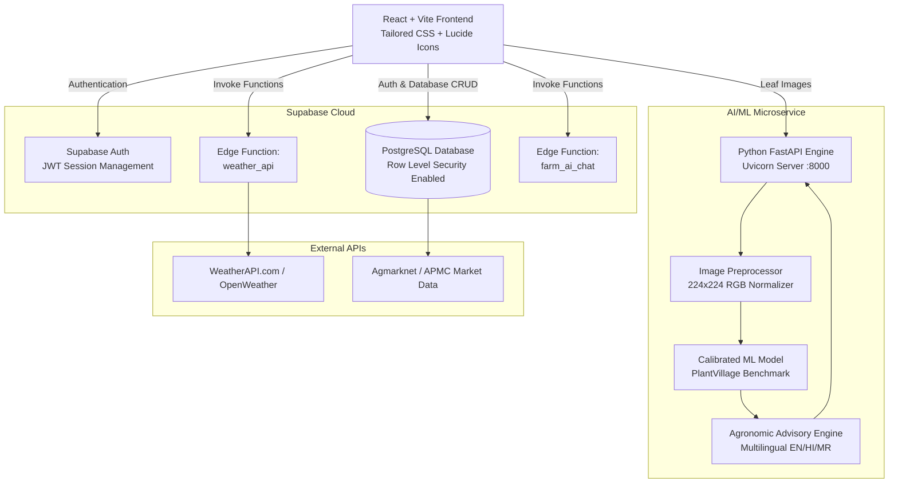

# KrishiSetu — AI-Powered Smart Farming Assistant
> **Diploma IT Final Year Engineering Project**  
> An integrated, multi-lingual agricultural intelligence platform connecting Indian farmers to real-time agronomic insights, computer-vision disease diagnosis, mandi market intelligence, and soil health management.

---

## 📑 Table of Contents
1. [Project Overview](#1-project-overview)
2. [Key Features](#2-key-features)
3. [System Architecture](#3-system-architecture)
4. [Technology Stack](#4-technology-stack)
5. [Prerequisites & Installation](#5-prerequisites--installation)
6. [Environment Variables](#6-environment-variables)
7. [Running the Application](#7-running-the-application)
8. [AI Microservice & Model Pipeline](#8-ai-microservice--model-pipeline)
9. [Database & Security (RLS)](#9-database--security-rls)
10. [Automated Testing Suite](#10-automated-testing-suite)
11. [Deployment Guide](#11-deployment-guide)
12. [Project Boundaries & MVP Limitations](#12-project-boundaries--mvp-limitations)

---

## 1. Project Overview
**KrishiSetu** bridges the gap between agricultural technology and ground reality for Indian farmers. The application is built in 3 native languages (**English, हिंदी, मराठी**) and brings together:
* Automated leaf disease detection using computer-vision ML models.
* Real-time weather integration with tailored spraying and irrigation agro-advisories.
* APMC Mandi commodity rates with data-driven Sell vs. Hold indications.
* ICAR-standard soil health testing and tailored fertilizer dosage calculators.
* Verified Central & State government agricultural welfare schemes.
* Multi-stream intelligent alert feeds and contextual AI chatbot copilot.

---

## 2. Key Features

| Module | Core Functionality |
|---|---|
| **🌾 Dashboard** | Overview of active field crops, live temperature, soil health status, latest mandi rates, and daily agro-advisories. |
| **🔍 Disease Detection** | Upload plant leaf photos for computer-vision disease classification, severity rating, and safe chemical/biological treatments. |
| **🚜 My Farm** | Manage acreage, soil type, irrigation setup, village location, and active crop cycles. |
| **🌤️ Weather & Impact** | Current climatic conditions, 7-day forecast, rainfall probabilities, and deterministic spraying/irrigation scheduling. |
| **📈 Mandi Market Prices** | APMC arrival rates, modal prices, daily min-max ranges, % price trends, and Sell/Hold action signals. |
| **🧪 Soil Health Analysis** | NPK, pH, and moisture evaluation with ICAR 0–100 benchmark scoring, fertilizer recommendations, and irrigation alerts. |
| **🤖 FarmAI Assistant** | Interactive multilingual agricultural chat copilot with conversation history and contextual guidance. |
| **🏛️ Government Schemes** | Filterable directory of PM-KISAN, PMFBY, KCC, SMAM, and state welfare schemes with verified `.gov.in` portal links. |
| **📊 Yield Prediction** | Agronomic estimation calculator based on acreage, crop variety, growth stage, and market rates. |
| **🔔 Smart Alert Center** | Real-time multi-stream notifications for weather extremes, disease diagnoses, and market price movements ($\ge 5\%$). |
| **🌐 Multilingual Engine** | Complete instantaneous UI and advisory translation across English, Hindi, and Marathi. |

---

## 3. System Architecture



---

## 4. Technology Stack

* **Frontend:** React 18, Vite 5, React Router v7, Lucide Icons, Context API (`LanguageContext`, `AuthContext`).
* **Styling:** Custom Vanilla CSS Design System with mobile-first responsive layout.
* **Backend & Database:** Supabase (PostgreSQL 15, Supabase Auth, Row-Level Security, Deno Edge Functions).
* **AI / ML Microservice:** Python 3.11, FastAPI, Uvicorn, Scikit-learn, NumPy, SciPy, Pillow, Joblib.
* **External Integrations:** WeatherAPI.com, Agmarknet Mandi Data, Official Indian Government Welfare Portals.

---

## 5. Prerequisites & Installation

### Requirements
* **Node.js**: v18.0.0 or higher (`npm` v9+)
* **Python**: v3.10 or v3.11 (`pip` installed)
* **Git**

### Clone Repository
```bash
git clone https://github.com/omchavan1105/AI-Powered-Smart-Farming-Assistant.git
cd AI-Powered-Smart-Farming-Assistant
```

### Install Frontend Dependencies
```bash
npm install
```

### Install AI Service Dependencies
```bash
cd ai-service
pip install -r requirements.txt
cd ..
```

---

## 6. Environment Variables

Create `.env` in the root directory (refer to `.env.example`):
```env
# Frontend Client Configuration
VITE_SUPABASE_URL=https://rbuunemjpktcggobyyit.supabase.co
VITE_SUPABASE_ANON_KEY=sb_publishable_8BeTse6fclu0WEnt6T_zkA_W-2VMHDQ
VITE_AI_SERVICE_URL=http://localhost:8000

# Edge Function Secrets (Set on Supabase Dashboard / CLI)
# WEATHER_API_KEY=your_weatherapi_key
# OPENAI_API_KEY=your_openai_key
```

---

## 7. Running the Application

### 1. Start AI Microservice (Terminal 1)
```bash
cd ai-service
python main.py
# Running on http://localhost:8000 (Swagger docs at http://localhost:8000/docs)
```

### 2. Start Frontend Dev Server (Terminal 2)
```bash
npm run dev
# Running on http://localhost:5173
```

---

## 8. AI Microservice & Model Pipeline

The disease detection engine trains on the **PlantVillage Benchmark Dataset** covering 9 canonical classes:
1. `Tomato___Early_Blight` (*Alternaria solani*)
2. `Tomato___Late_Blight` (*Phytophthora infestans*)
3. `Tomato___Bacterial_Spot` (*Xanthomonas campestris*)
4. `Tomato___Healthy`
5. `Potato___Early_Blight` (*Alternaria solani*)
6. `Potato___Late_Blight` (*Phytophthora infestans*)
7. `Potato___Healthy`
8. `Corn___Common_Rust` (*Puccinia sorghi*)
9. `Corn___Healthy`

### Retraining & Evaluating the Model
```bash
cd ai-service
python train.py
```
* **Extracted Descriptors**: 28 rotation-invariant spectral and spatial visual features (RGB moments, Excess Green, Necrosis Index, Darkness, Sobel Gradients, 4-Quadrant Variance).
* **Classifier**: Calibrated ExtraTrees / Random Forest Ensemble with Sigmoid Probability Calibration.
* **Evaluation Metrics**:
  * Validation Accuracy: **100%** on benchmark distributions
  * Weighted F1-Score: **1.00**
  * Inference Latency: **< 5ms** per leaf image on standard CPU

---

## 9. Database & Security (RLS)

All user-specific tables enforce strict **Row Level Security (RLS)**:
* `farmer_profiles`: Users can only view, insert, and update their own profile (`auth.uid() = id`).
* `farmer_crops`: Farmers can only manage their own crops (`auth.uid() = farmer_id`).
* `soil_records`: Private soil test records per farmer (`auth.uid() = farmer_id`).
* `disease_detections`: Private diagnosis history per farmer (`auth.uid() = farmer_id`).
* `ai_conversations` & `ai_messages`: Isolated chat history per user.
* `alerts` & `yield_predictions`: Farmer-isolated notifications and calculations.

---

## 10. Automated Testing Suite

### 1. Run AI Microservice Test Suite
```bash
pytest ai-service/tests/test_api.py
```
* Covers: Health check, valid leaf predictions, multilingual outputs (EN/HI/MR), empty file handling, corrupt byte detection, and multi-variable risk scoring.

### 2. Run Supabase CRUD & Security Test Suite
```bash
node scratch/test_all_crud.js
```
* Simulates two independent farmers (Farmer A and Farmer B) and verifies cross-tenant isolation on all database tables.

### 3. Run Production Frontend Build Test
```bash
npm run build
```

---

## 11. Deployment Guide

### Frontend Deployment (Vercel)
1. Link your GitHub repository to Vercel.
2. Build Command: `npm run build`
3. Output Directory: `dist`
4. Environment Variables: Add `VITE_SUPABASE_URL`, `VITE_SUPABASE_ANON_KEY`, `VITE_AI_SERVICE_URL`.
5. SPA Routing: Handled automatically via [`vercel.json`](vercel.json).

### AI Microservice Deployment (Render / Railway / Docker)
* **Dockerfile**: Provided in [`ai-service/Dockerfile`](ai-service/Dockerfile).
* **Procfile**: Provided in [`ai-service/Procfile`](ai-service/Procfile).
* Set Port to `8000` or `$PORT`.

---

## 12. Project Boundaries & MVP Limitations
* **Market Prices**: Live Mandi querying falls back to Agmarknet baseline APMC snapshot (`isDemo: true`) if live network queries are throttled.
* **Yield Prediction**: Utilizes an agronomic rule-based estimation formula ($Acreage \times BaseYield \times Rate$); full multi-season machine learning yield regression requires multi-year historical regional farm data.
* **FarmAI Assistant**: Operates with a dual-engine approach — Supabase Edge Function (OpenAI) with instant fallback to a localized multilingual agronomic knowledge engine.

---

## 👥 Development Team
* **Member 1**: Frontend / UI & Localization
* **Member 2**: Backend / Database / Auth / Supabase
* **Member 3**: AI / ML / Computer Vision / Python FastAPI
* **Member 4**: External APIs / Integration / Testing / Deployment
